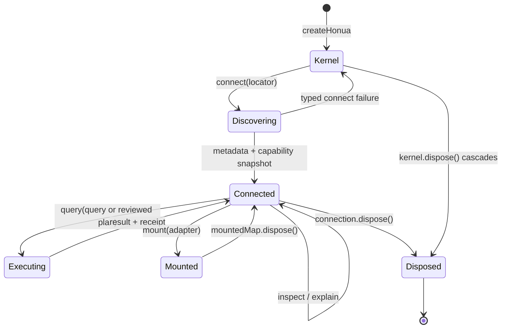

# North-star SDK application-kernel contract

Status: **accepted for review** on 2026-07-10 for
[`honua-sdk-js#386`](https://github.com/honua-io/honua-sdk-js/issues/386).
Merging this decision accepts the product boundary and TypeScript direction;
it does not claim that the proposed facade is implemented.

Implementation note (issues #532-#534): the reviewed root now ships the first
additive application path. `createHonua()` owns instance-local discovery policy,
cache, cancellation, and managed connections; `connect()`, immutable
`inspect()` / `inspect({ refresh: true })`, explicit `source()` selection,
accepted-plan `explain()` / `query()`, renderer `mount()`, and async disposal are
implemented. The pre-existing standalone `connect()` keeps its lower-level
`HonuaConnection` type, so the owned additive handle is named
`HonuaKernelConnection`. The MapLibre adapter lives under the runtime subpath,
retains only caller-injected peers, reuses the existing automatic source
strategy, and reports first-frame readiness through the connection-owned
`MountedMap`. Diagnostics channels, plugins, columnar execution, and additional
renderers remain future slices and are not claimed by this note.

## Decision summary

Honua will be a **universal geospatial application kernel**, not a proprietary
renderer and not an application shell:

> Connect to a spatial source, understand it automatically, explain and execute
> the best available plan, render it through an interchangeable engine, and
> automate the same plan under explicit policy.

The small front-door vocabulary is:

1. `createHonua()` creates one resource owner and policy boundary.
2. `honua.connect(locator)` discovers an endpoint or static asset and returns a
   connection.
3. `connection.inspect()` returns schema, effective capabilities, diagnostics,
   freshness, and provenance.
4. `connection.explain(query)` returns a serializable execution plan without
   reading result data.
5. `connection.query(queryOrPlan)` executes either a query or a previously
   inspected plan.
6. `connection.mount(target, options)` projects the same source/plan and linked
   state through an optional renderer adapter.
7. Every owned handle has idempotent `dispose()` and `Symbol.asyncDispose`.

`Dataset -> Source -> Query -> Result` remains the protocol-neutral semantic
contract. The kernel is an orchestration facade over it, not a replacement.
Focused subpaths remain the advanced API and escape hatch.

## Product boundary

### The kernel owns

- URL and static-asset classification, endpoint-layout discovery, metadata
  caching, and effective capability negotiation.
- Resource ownership, cancellation, diagnostics, provenance, and operation IDs.
- A protocol-neutral query intermediate representation, plan selection, and
  execution receipts.
- Renderer adapter lifecycle and renderer-fidelity reporting.
- Policy hooks used by people, applications, and agents to execute the same
  plans.
- Stable extension seams for protocol, loader, renderer, auth, cache, realtime,
  and analysis plugins.

### The kernel does not own

- Raster/vector/3D rendering engines. MapLibre, deck.gl, and Cesium remain
  optional peers maintained by their respective projects.
- Application shells, dashboards, widget libraries, Studio, Operator, or
  hosted-product administration. Those remain in `@honua/app-platform` or
  product repositories, consistent with the accepted
  [1.0 scope split](./scope-split-and-1.0.md).
- An opaque AI execution path. Agent prompts must compile to the same typed,
  inspectable plan used by human-authored code.
- Silent protocol emulation. Fallback and fidelity loss are plan steps and
  diagnostics; unsupported operations remain typed failures.
- Ownership of sample-gallery prose or a second copy of example code in the
  website repository.

## Public TypeScript shape

This section fixes names, ownership, and behavior. Exact helper overloads can
be refined in implementation issues only when they preserve these invariants.
The compile-only contract is committed under
[`test/design/north-star-api/`](../../test/design/north-star-api/).

### Kernel and connection

```ts doc-test=skip reason="partial excerpt requires application host context"
interface HonuaKernel extends AsyncDisposable {
  readonly diagnostics: DiagnosticChannel;
  connect<T = Record<string, unknown>>(
    locator: string | URL | ConnectLocator,
    options?: ConnectOptions,
  ): Promise<HonuaConnection<T>>;
  dispose(): Promise<void>;
}

interface HonuaConnection<T> extends AsyncDisposable {
  readonly id: string;
  readonly dataset: Dataset;
  readonly sourceDescriptors: readonly SourceDescriptor[];
  readonly diagnostics: DiagnosticChannel;

  inspect(options?: { refresh?: boolean; signal?: AbortSignal }): Promise<ConnectionInspection>;
  source<TSource = T>(id?: SourceId): Source<TSource>;
  explain<F extends "features" | "columnar" = "features">(
    query: Readonly<Query<T>>,
    options?: ExplainOptions<F>,
  ): Promise<ExecutionPlan<T, F>>;
  query<F extends "features" | "columnar" = "features">(
    queryOrPlan: Readonly<Query<T>> | ExecutionPlan<T, F>,
    options?: QueryOptions<F>,
  ): Promise<PlannedQueryResult<T, F>>;
  mount<TKind extends RendererKind = RendererKind, TRaw = unknown>(
    target: string | Element | object,
    options: MountOptions<T, TKind, TRaw>,
  ): Promise<MountedMap<TKind, TRaw>>;
  dispose(): Promise<void>;
}
```

`createHonua({ plugins })` accepts versioned lightweight plugin descriptors.
Static/analytics engines such as GeoParquet/DuckDB are activated by importing a
focused plugin factory and injecting its peer module; `connect()` never reaches
out to a CDN or loads a heavy engine by surprise. The complete plugin lifecycle
and certification metadata are owned by #392.

`connect()` completes baseline discovery before resolving. A layer/collection
URL has one default source. A service/catalog root may discover many; calling
`source()`, `query()`, `explain()`, or `mount()` without a source then throws a
typed ambiguity error listing valid source IDs and recovery guidance. It never
chooses the first collection silently.

`connection.source(id)` returns the existing `Source<T>`. Advanced callers keep
`Source.protocol(kind)` for typed raw protocol access. The legacy
`Source.adapter()` alias is not promoted into the facade.

### Inspection

```ts doc-test=skip reason="partial excerpt requires application host context"
interface ConnectionInspection {
  readonly id: string;
  readonly endpoint: string;
  readonly defaultSourceId?: SourceId;
  readonly sources: readonly SourceInspection[];
  readonly observation: Observation;
  readonly diagnostics: readonly KernelDiagnostic[];
}

interface SourceInspection extends SourceDescriptor {
  readonly discovery: "metadata" | "declared" | "inferred" | "unavailable";
  readonly title?: string;
  readonly geometryType?: string;
  readonly crs?: string;
  readonly observation: Observation;
}
```

The snapshot is immutable. `inspect()` uses the metadata snapshot established
by `connect()`; `{ refresh: true }` conditionally revalidates it. Discovery
failure is explicit (`discovery: "unavailable"` plus a diagnostic), not
fabricated protocol defaults presented as observed server truth.

### Explain and query

An execution plan includes:

- a stable ID and deterministic fingerprint;
- connection/source identity and the canonical query;
- ordered remote, worker, renderer, or client steps;
- pushdown degree and reason for each step;
- expected requests, rows, and bytes where estimable;
- cache decision and freshness policy;
- required authorization scopes;
- exact/equivalent/approximate/unsupported fidelity;
- provenance, expiry, and structured diagnostics.

`explain()` may refresh metadata under the caller's freshness policy but must
not fetch result rows or mutate application/renderer state. `query(plan)`
executes the reviewed plan only when its fingerprint, source version, policy,
and validity window still match. Otherwise it throws `plan-stale` with a
replacement plan; it does not silently re-plan.

Feature output is additive to today's result contract:

```ts doc-test=skip reason="partial excerpt requires application host context"
type FeatureQueryResult<T> = Result<T> & {
  readonly format: "features";
  readonly execution: ExecutionReceipt;
};
```

Columnar output is a distinct result so a million-row path does not materialize
JavaScript feature objects:

```ts doc-test=skip reason="partial excerpt requires application host context"
interface ColumnarQueryResult<T> {
  readonly format: "columnar";
  readonly schema: readonly { name: string; type: string }[];
  readonly batches: AsyncIterable<ColumnarBatch<T>>;
  readonly execution: ExecutionReceipt;
}
```

Cancellation is end-to-end. Aborting a query stops page fetches, worker work,
and renderer ingestion. A partial stream carries a terminal diagnostic and is
never represented as a complete `Result`.

### Mount and renderer escape hatches

```ts doc-test=skip reason="partial excerpt requires application host context"
type BuiltInRendererKind = "maplibre" | "deckgl" | "cesium";
type RendererKind = BuiltInRendererKind | (string & {});

interface RendererAdapter<TKind extends RendererKind = RendererKind, TRaw = unknown> {
  readonly kind: TKind;
  readonly environments: readonly ("browser" | "node" | "worker")[];
  readonly peer: unknown; // caller-injected module; never a core import
}

interface MountedMap<TKind extends RendererKind = RendererKind, TRaw = unknown>
  extends AsyncDisposable {
  readonly id: string;
  readonly renderer: TKind;
  readonly ready: Promise<void>;
  readonly diagnostics: DiagnosticChannel;
  raw(kind: TKind): TRaw | undefined;
  dispose(): Promise<void>;
}
```

The three built-in identifiers are convenience literals, not a closed renderer
vocabulary. A third-party renderer declares a stable namespaced identifier in
its plugin manifest, registers it explicitly, and receives the same typed raw
handle through the generic adapter. Registration rejects unknown or
API-incompatible adapters with structured diagnostics; core never infers a
renderer merely from an arbitrary string. Certification is independent evidence,
not a hard-coded runtime allowlist. The kit in #392 must prove this seam with an
external-style renderer that is not imported by SDK core.

`mount()` resolves after the adapter accepts the source/layer plan. `ready`
resolves after the first usable frame and rejects with render diagnostics.
Automatic styles are deterministic schema/geometry projections and include a
fidelity report; `"auto"` is never a remote generative call.

When passed a selector or element, the SDK owns the renderer it creates. When
passed an existing renderer host, it borrows the host by default and removes
only Honua-owned sources, layers, listeners, workers, and requests. `raw(kind)`
is the renderer-specific escape hatch; renderer methods do not leak into the
kernel contract.

MapLibre adapter construction lives under `@honua/sdk-js/runtime`; deck.gl and
Cesium adapters may use focused subpaths decided by their implementation
issues. Importing `@honua/sdk-js` must not load any renderer, DuckDB, Arrow,
Cesium, or model-provider code.

### Diagnostics, freshness, and provenance

Diagnostics use one channel at kernel, connection, execution, and mounted-map
scope. `snapshot()` supports post-failure inspection; `subscribe()` supports
live developer tooling. Every diagnostic has an ID, stage, severity, operation
ID, optional source ID, remediation, and preserved cause.

```ts doc-test=skip reason="partial excerpt requires application host context"
interface Observation {
  readonly state: "live" | "cached" | "replayed" | "pending-local";
  readonly observedAt: string;
  readonly validAt?: string;
  readonly expiresAt?: string;
  readonly cursor?: string;
  readonly provenance: readonly ProvenanceRecord[];
}
```

- `live`: read from the addressed service during this operation.
- `cached`: served from a cache and accompanied by observation/expiry time.
- `replayed`: deterministic fixture, offline log, or resumed cursor replay.
- `pending-local`: an optimistic local edit not yet accepted upstream.

Signed URLs and credentials never appear in provenance or diagnostics. The
canonical source URL drops query credentials and records a stable asset ID or
origin/path. Receipts distinguish the metadata observation from the result-data
observation so fresh metadata cannot make replayed rows appear live.

### Agent proposal contract

Agent planning stays in `@honua/sdk-js/agent-tools` and requires a caller-owned
model/provider. No provider SDK enters the root bundle.

```ts doc-test=skip reason="partial excerpt requires application host context"
const proposal = await agent.propose(instruction, {
  connections: [incidents],
  policy: { allow: ["data:read", "map:write"], deny: ["data:write", "publish"] },
});
const preview = await proposal.dryRun();
const grant = preview.allowed ? await host.requestApproval(proposal.approval) : undefined;
if (grant) await proposal.execute({ approval: grant });
```

`dryRun()` performs validation and estimates but no data or renderer mutation.
Every agent-generated execution requires a host-issued, opaque approval grant
bound to the proposal ID and plan fingerprint. A changed plan invalidates the
grant. Read-only is the default policy; data edits and publish are denied unless
independently granted. Every attempt, denial, execution, and compensating action
emits an audit diagnostic and execution receipt.

## Lifecycle and ownership



Disposal rules:

- Every `dispose()` is idempotent and awaits in-flight cancellation/worker
  shutdown.
- `MountedMap.dispose()` disposes its owned renderer session, not the
  connection or borrowed host.
- `HonuaConnection.dispose()` aborts its executions and disposes mounted maps,
  metadata watches, loader workers, and source-local caches it owns.
- `HonuaKernel.dispose()` disposes all connections and kernel-owned auth/cache
  resources. Caller-supplied providers and renderer hosts remain caller-owned.
- Any operation after disposal throws the existing typed `disposed` pattern.

## Dependency direction

```mermaid
flowchart TD
  Apps[Applications / @honua/react / app-platform] --> Kernel[Small kernel facade]
  Agents[@honua/sdk-js/agent-tools] --> Planner[Query IR + execution planner]
  Kernel --> Planner
  Kernel --> Contract[Dataset / Source / Query / Result]
  Planner --> Contract
  Contract --> Protocols[First-party protocol adapters]
  Kernel --> RenderContract[Renderer adapter contract]
  MapLibre[MapLibre adapter] --> RenderContract
  Deck[deck.gl adapter] --> RenderContract
  Cesium[Cesium adapter] --> RenderContract
  MapLibre -. optional peer .-> MLPeer[maplibre-gl]
  Deck -. optional peer .-> DeckPeer[deck.gl / Arrow]
  Cesium -. optional peer .-> CesiumPeer[cesium]
  Plugins[Certified third-party plugins] --> Contract
  Plugins --> RenderContract
```

The arrows are dependencies. Core never points to React, app-platform,
renderer peers, DuckDB, or model providers. A renderer adapter may depend on
the kernel contract; the kernel refers only to the adapter interface.

## Golden workflows

The authoritative compile fixtures are:

1. [`public-url-to-map.ts`](../../test/design/north-star-api/public-url-to-map.ts)
2. [`large-data-linked-analysis.ts`](../../test/design/north-star-api/large-data-linked-analysis.ts)
3. [`safe-agent-proposal.ts`](../../test/design/north-star-api/safe-agent-proposal.ts)
4. [`third-party-renderer.ts`](../../test/design/north-star-api/third-party-renderer.ts)

They are checked by `npm run verify:north-star-api`. They import a design-only
contract under `test/design`; no production API was added for this ADR.

### 1. Public URL to useful map

This is the normative basic workflow: nine application lines including imports,
inspection, first-frame readiness, and cleanup; no key or Honua account.

```ts doc-test=skip reason="normative future API; compile fixture lives under test/design"
import * as maplibregl from "maplibre-gl";
import { createHonua } from "@honua/sdk-js";
import { maplibreRenderer } from "@honua/sdk-js/runtime";
const honua = createHonua();
const data = await honua.connect(PUBLIC_FEATURE_LAYER_URL);
const info = await data.inspect();
const map = await data.mount("#map", { renderer: maplibreRenderer(maplibregl), style: "auto" });
await map.ready;
await honua.dispose();
```

### 2. Large-data linked analysis

The workflow connects an AWS-hosted GeoParquet/PMTiles asset, requests columnar
or tiled display execution, reuses the stable `ExplorationContext` for map,
table, chart, filter, and selection state, and pushes an aggregate summary to
DuckDB or the remote service. The plan must prove that the display path does
not materialize unbounded feature objects. `deck.gl` and DuckDB are injected
optional peers. A viewport/filter change creates a new fingerprinted plan; it
does not mutate the reviewed plan in place.

### 3. Safe agent-proposed plan

The workflow connects the deployed `demo.honua.io` feature surface, compiles a
prompt into the same execution-plan type, dry-runs it, requests approval, and
executes only with a plan-bound grant. The fixture proves at compile time that
`proposal.execute()` cannot be called without an `ApprovalGrant`.

### DX review

| Workflow | Application lines / introduced concepts | Required configuration | Cleanup contract |
| --- | --- | --- | --- |
| Public URL -> map | 9 lines including imports; kernel, connection, renderer adapter, mounted handle | Public URL only; no account/key | One awaited `honua.dispose()` cascades connection and owned map |
| Large-data linked analysis | 1 connection, 2 reviewed plans, 1 existing exploration context, 2 optional peer factories | AWS asset locator supplied by public config or runner; never an embedded signed URL | Kernel disposes worker/connection/map; caller disposes its exploration context |
| Safe agent proposal | 1 connection, proposal, dry run, approval grant, receipt | Caller-owned model provider and host approval callback | Kernel disposal plus provider lifecycle retained by caller |

Only the first workflow is constrained to ten application lines. Advanced
workflows deliberately expose plans, peers, and ownership rather than hiding
cost or authority behind defaults.

## Deterministic and live validation lanes

Each golden workflow has two evidence lanes; neither substitutes for the other.

| Lane | Trigger | Inputs | Required evidence |
| --- | --- | --- | --- |
| Deterministic | Every pull request, offline | Committed metadata/result/columnar fixtures and a deterministic agent provider | Typecheck, semantic assertions, recorded provenance sidecar, replayed freshness state, disposal/leak assertions |
| Public live | Scheduled and manual | Public AWS assets, public endpoints, and deployed `https://demo.honua.io` | Discovery/query/render or headless-plan success, live provenance/freshness, latency/bytes, explicit endpoint/version report |
| Authenticated live | Scheduled/manual when configured | Private AWS objects or protected demo capabilities | GitHub OIDC or repository secrets supplied only to the runner; explicit executed/credential-unavailable status; no silent green skip |

Credential rules:

- Example source, HTML, browser bundles, fixture metadata, logs, diagnostics,
  snapshots, and PR artifacts contain no secret, bearer token, access key,
  signed-URL query, or credential-bearing source URL.
- Prefer public read-only AWS sample assets. Authenticated AWS CI uses short-lived
  OIDC credentials and resolves private locators inside the runner.
- Browser examples never receive CI secrets through `VITE_*` variables.
- Fixture refresh is a reviewed script that strips credentials, records source
  identity/version/retrieval time/license, and produces a deterministic digest.
- A live-lane result reports `executed`, `failed`, or
  `credential-unavailable`; missing credentials do not masquerade as execution.

The SDK repository owns executable samples and tests. Each flagship example
will expose a small, versioned catalog manifest containing slug, title,
capabilities, protocols, renderer, fixture command, live command, screenshot,
and provenance metadata. The `honua-site` samples directory/gallery consumes a
generated projection of that manifest and links to or embeds the deployed SDK
artifact. It must not fork `src/`, mock servers, fixtures, or workflow logic.
Changes flow SDK example -> validated catalog artifact -> site projection. The
site may own narrative/marketing copy and ordering, but not a second executable
implementation.

The current sample inventory is evidence, not a preservation constraint. The
program optimizes for compelling task journeys, time to first success, and
clear proof of differentiated capability. During curation, each current sample
receives an explicit **keep, rework, merge, replace, or retire** disposition;
legacy URLs get redirects where appropriate, but weak examples are not retained
solely to avoid change. SDK-side execution is tracked by #398 (modernization
epic), #399 (flagship migrations), #400 (generated learning/docs), and #401
(versioned manifest/artifact/evidence contract). The site-side catalog
projection is [honua-site#120](https://github.com/honua-io/honua-site/issues/120)
and the task-journey experience redesign is
[honua-site#121](https://github.com/honua-io/honua-site/issues/121). This
decision PR intentionally does not edit `honua-site`.

## Environment and distribution compatibility

| Environment | Supported kernel operations | Constraints |
| --- | --- | --- |
| Node 20+ | `connect`, `inspect`, `explain`, `query`, streaming, agent planning | No DOM `mount`; a headless adapter must explicitly advertise Node support. Browser auth stores are unavailable. |
| Browser ESM/bundler | All operations | Renderer/analytics peers are explicit imports; workers obey CSP and are disposable. |
| Web Worker | `connect`, `inspect`, `explain`, `query`, columnar processing | No element/selector mount. `OffscreenCanvas` requires an adapter that advertises worker support. Auth/cache implementations are injected. |
| React 18/19 | Same kernel through `HonuaProvider` and hooks | StrictMode cannot duplicate connections/subscriptions; component unmount disposes only resources it owns. |
| Build-less ESM | Root/browser kernel plus URL-imported focused adapters | Import maps resolve optional peers; no implicit bare import or dynamic CDN dependency. |

The root stays ESM-only, NodeNext-compatible, strict, and side-effect free.
Renderer and analytics adapters declare peers and carry their own bundle
budgets. `createHonua()` and built-in lightweight discovery must preserve the
one-lightweight-stable-core-capability posture established by #357. The other
direct dependencies are bounded compatibility plumbing:
`@honua/honua-migrate` backs deprecated migration forwarders, and the temporary
style-spec parser pin preserves Node 20 engine compatibility.

## Mapping to the current SDK

| North-star concept | Existing symbol(s) | Disposition |
| --- | --- | --- |
| `createHonua()` | `new HonuaClient()`, `createDataset()` | Add a thin owner/facade after discovery/planner contracts land; retain both low-level APIs. |
| `connect()` | `createDataset`, `SourceLocator.layout`, URL parsers, OGC/STAC landing-page discovery, GeoParquet/PMTiles resolvers | Compose and generalize. Do not add another protocol-specific constructor. Tracked by #391. |
| `HonuaConnection` | `Dataset` plus owned metadata/worker/runtime handles | New orchestration handle; its `dataset` exposes the existing contract. |
| `inspect()` | `SourceDescriptor`, `SourceSchema`, `Capabilities`, `Source.protocol(...).describe()`, metadata cache docs | Normalize into immutable observed metadata; distinguish discovered vs declared defaults. |
| `query()` | `Source.query`, `queryAll`, `stream`, `queryAggregate` | Reuse adapter execution. The facade adds plan/receipt/format; direct `Source` calls remain valid. |
| `explain()` / `ExecutionPlan` | Per-adapter compilers, `DegradedReason`, query-tile diagnostics | New shared planner contract, not a wrapper around log strings. Tracked by #389. |
| Feature results | `Result<T>` | Preserve fields; add mandatory execution receipt only on the facade result. |
| Columnar results | GeoParquet/DuckDB runtime and row mapping | Replace row-object default for large paths with batches; tracked by #394. |
| `mount()` | `loadMapPackage`, `HonuaMapRuntime`, `HonuaMap`, source bridge | Adapt behind renderer contract; do not add renderer methods to `Dataset`/`Source`. |
| MapLibre adapter | `HonuaMapRuntime`, `MaplibreMap`, `loadHonuaFeatureServiceGeoJson` | Productionize automatic source/style projection under #390. |
| deck.gl adapter | No stable production adapter | New optional adapter under #388. |
| Cesium adapter | App-platform scene adapters and compatibility examples | New stable renderer adapter without moving scene-workspace back into core; #395. |
| Linked state | `ExplorationContext`, view controllers, interaction bindings | Reuse unchanged; `mount`/planner accept snapshots and bindings. |
| Diagnostics | typed error hierarchy, `Result.degraded`, runtime diagnostics/events, request/runtime telemetry | Unify through a scoped channel while preserving typed errors. |
| Freshness/provenance | `SourceFreshnessContract`, cache diagnostics, realtime cursors | Keep declared freshness and add observed state/receipts; #393 and #396 implement storage/stream semantics. |
| Agent proposal | `createHonuaAiMapKit`, tool executor, audit events, MCP evals | Reuse tools/audit; add provider-neutral proposal -> plan -> grant flow under #397. |
| Plugin | `resolveSource`, declaration-merging adapter map, auth/GeoParquet/PMTiles injection seams | Converge on one versioned plugin lifecycle and certification contract under #392. |
| Disposal | `HonuaMapRuntime.dispose`, `ExplorationContext.dispose`, `GeoparquetRuntime.dispose`, React cleanup | Compose under kernel ownership; retain leaf disposal methods. |
| React | `HonuaProvider`, `useDataset`, `useQuery`, `HonuaMap` | Evolve bindings to accept kernel/connection; no second cache or planner. |
| Raw escape hatch | `Source.protocol()`, runtime `.map`, protocol clients | Keep `Source.protocol`; replace direct runtime leakage in the facade with typed `MountedMap.raw(kind)`. |

## Name collisions and migration rules

- `HonuaClient` remains the raw transport/service client. It is not renamed to
  `HonuaKernel`; `createHonua()` owns one or more clients as discovery requires.
- `HonuaMap` remains a programmatic source/layer model. The mounted resource is
  named `MountedMap`, avoiding a third `HonuaMap` class.
- `loadMapPackage()` remains the explicit saved-package path. `mount()` may
  compile a transient package internally but must not hide hosted-package fetch
  or validation semantics.
- `inspect()` is normalized kernel metadata. Protocol-specific `describe()`,
  `getCapabilities()`, and layer-metadata calls remain raw escape hatches.
- `ExecutionPlan` is distinct from app-platform Operator/Studio plans. The
  latter may reference an execution-plan fingerprint but do not define SDK
  execution semantics.
- React's `<HonuaMap>` is a component, while `MountedMap` is its owned/borrowed
  imperative handle. The component delegates to `mount()`.
- No existing stable symbol is deprecated by this ADR. Low-level contracts are
  essential advanced APIs. Deprecation may begin only after the facade has
  equivalent conformance and migration documentation.
- Expired app-platform shims remain governed by #385; this design does not use
  them or move app-shell concepts back into the stable package.

## Follow-on contract

The implementation issues must reference and preserve this decision:

- #391: `connect`, discovery, inspection, and effective capabilities.
- #389: query IR, plan fingerprint, explain semantics, and receipts.
- #390, #388, #395: MapLibre, deck.gl, and Cesium adapters.
- #394: columnar result and worker semantics.
- #393 and #396: observed freshness, cursors, persistent caches, and pending
  local edits.
- #397: agent proposal, policy, approval grant, audit, and provenance.
- #392: plugin lifecycle and certification.
- #385 and #387: stable surface/bundle reconciliation and measurable DX gates.
- #398, #399, #400, and #401: compelling flagship journeys, generated learning
  material, and the SDK-owned sample artifact/evidence projection contract.
- [honua-site#120](https://github.com/honua-io/honua-site/issues/120) and
  [honua-site#121](https://github.com/honua-io/honua-site/issues/121): consume
  the SDK projection and redesign the samples/docs experience without copying
  executable implementations.

An implementation may extend a focused option type, but changing ownership,
silent-fallback rules, plan review semantics, observed-state vocabulary, or
dependency direction requires a superseding ADR.

## Consequences

Positive:

- The common path is materially smaller without hiding the existing powerful
  contract.
- Protocols, renderers, human-authored queries, and agent actions converge on
  one explainable execution model.
- Optional peers and app-platform separation remain enforceable.
- Live AWS/demo evidence and deterministic CI prove different failure classes
  while sharing provenance semantics.

Costs:

- `connect()` cannot ship honestly until metadata discovery is consistent.
- Plans and receipts become versioned public contracts requiring conformance
  fixtures across every adapter.
- Renderer adapters must expose fidelity differences instead of promising
  impossible parity.
- Resource ownership and live-lane evidence add work to every new plugin.

## Acceptance evidence for #386

- Product boundary and API/lifecycle/dependency decisions: this ADR.
- Three compile-tested workflows: `test/design/north-star-api/*.ts`.
- Current-symbol collision and migration inventory: mapping sections above.
- Node/browser/worker/React/build-less and optional-peer rules: compatibility
  sections above.
- No production API: the proposed declarations live only under `test/design`.
- Follow-on traceability: issue list above; each implementation ticket receives
  a link to this accepted-for-review contract.
